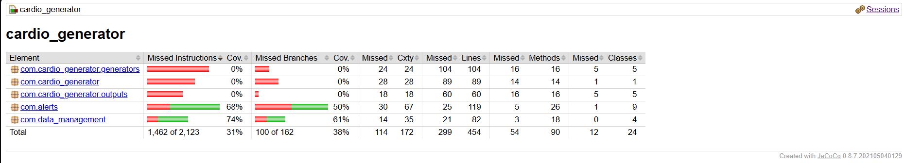

# Cardio Data Simulator

The Cardio Data Simulator is a Java-based application designed to simulate real-time cardiovascular data for multiple patients. This tool is particularly useful for educational purposes, enabling students to interact with real-time data streams of ECG, blood pressure, blood saturation, and other cardiovascular signals.

## Features

- Simulate real-time ECG, blood pressure, blood saturation, and blood levels data.
- Supports multiple output strategies:
  - Console output for direct observation.
  - File output for data persistence.
  - WebSocket and TCP output for networked data streaming.
- Configurable patient count and data generation rate.
- Randomized patient ID assignment for simulated data diversity.

## Getting Started

### Prerequisites

- Java JDK 11 or newer.
- Maven for managing dependencies and compiling the application.

### Installation

1. Clone the repository:

   ```sh
   git clone https://github.com/tpepels/signal_project.git
   ```

2. Navigate to the project directory:

   ```sh
   cd signal_project
   ```

3. Compile and package the application using Maven:
   ```sh
   mvn clean package
   ```
   This step compiles the source code and packages the application into an executable JAR file located in the `target/` directory.

### Running the Simulator

After packaging, you can run the simulator directly from the executable JAR:

```sh
java -jar target/cardio_generator-1.0-SNAPSHOT.jar
```

To run with specific options (e.g., to set the patient count and choose an output strategy):

```sh
java -jar target/cardio_generator-1.0-SNAPSHOT.jar --patient-count 100 --output file:./output
```

### Supported Output Options

- `console`: Directly prints the simulated data to the console.
- `file:<directory>`: Saves the simulated data to files within the specified directory.
- `websocket:<port>`: Streams the simulated data to WebSocket clients connected to the specified port.
- `tcp:<port>`: Streams the simulated data to TCP clients connected to the specified port.

## License

This project is licensed under the MIT License - see the [LICENSE](LICENSE) file for details.

## Week 2: UML Modeling
For Project Part 2, four subsystems of the Cardiovascular Health Monitoring System were modeled to establish a clean, modular architecture. 

You can view the diagrams and read the design rationale for each system in the [UML Models folder](./uml_models).

## Week 3: Testing and Code Coverage
For Project Part 3, unit tests were implemented for the data management and alert generation systems using JUnit. Below is the JaCoCo code coverage report verifying the tests.


**Code Coverage Explanation:**
As shown in the JaCoCo report, the `com.alerts` and `com.data_management` packages have high coverage because unit tests were thoroughly implemented for the `AlertGenerator`, `DataStorage`, and `FileDataReader` classes. The `com.cardio_generator` packages currently show 0% coverage. These were intentionally left untested because they belong to the Week 1 simulator logic, and the scope of Project Part 3 was strictly limited to testing the new patient storage and alert generation systems.

## Week 4: Software Architecture & Design Patterns
For Project Part 4, the cardiovascular monitoring system was refactored to improve scalability, maintainability, and code organization. This was achieved by implementing several core Gang of Four (GoF) Design Patterns:

* **Singleton Pattern:** Applied to the `DataStorage` and `HealthDataSimulator` classes to guarantee that only one global instance of patient data and the simulation engine exists at runtime, preventing memory overlap and test pollution.
* **Strategy Pattern:** Extracted complex medical evaluation logic from the `AlertGenerator` into dedicated, modular classes (`BloodPressureStrategy`, `HeartRateStrategy`, `OxygenSaturationStrategy`) that all implement a common `AlertStrategy` interface.
* **Factory Method Pattern:** Implemented an `AlertFactory` to abstract and centralize the instantiation of `Alert` objects, allowing for flexible alert creation without hardcoding dependencies within the strategies.
* **Decorator Pattern:** Created an abstract `AlertDecorator` along with concrete `PriorityAlertDecorator` and `RepeatedAlertDecorator` classes. This allows the system to dynamically "wrap" standard alerts with special tags (e.g., `[PRIORITY]`) at runtime without altering the base `Alert` class structure.

### Regression Testing & Code Coverage
Following the refactoring process, regression testing was performed by updating the existing JUnit tests to accommodate the new Singleton memory state and the dynamically decorated alert strings. 

Below is the updated JaCoCo code coverage report verifying that the new architectural components were successfully integrated and tested.



**Code Coverage Explanation:**
As shown, the `com.alerts` and `com.data_management` packages maintain high coverage. The slight increase in overall coverage is due to the new architectural classes (Factory, Strategies, Decorators) being successfully triggered by our updated regression tests. The `com.cardio_generator` packages intentionally remain at 0% coverage as they belong to the legacy Week 1 simulator logic, which falls outside the required testing scope for this phase.

## Project Members

- Student ID: 6346179
